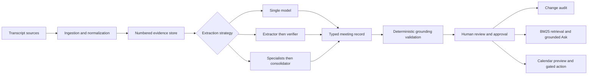

# Meeting to Action

## Capstone Project Documentation

**Purpose:** Convert meeting transcripts into trustworthy, human-approved actions, decisions, notes, and follow-up events while preserving direct evidence from the source.

**Technology:** Python 3.12, Streamlit, Azure Container Apps, Azure Container Registry, Microsoft Agent Framework, Microsoft Foundry, Pydantic, BM25 retrieval, Microsoft Graph and other content connectors.

---

## 1. Project Overview

### Problem statement

Meetings generate commitments, decisions, unresolved questions, and operational knowledge. That information is usually buried in long transcripts and must be manually converted into follow-up records. Generic summarizers can produce fluent output, but they often lose source traceability, infer owners or dates, and provide no controlled path from generated text to a business action.

Meeting to Action solves one narrow problem: **convert a single meeting transcript into a structured, evidence-grounded record that a person can review, approve, query, and use to prepare follow-up events.** The project deliberately does not attempt to be a general-purpose organizational assistant or autonomously execute tasks.

### Intended users

- Meeting organizers who need reliable minutes and follow-ups.
- Project managers tracking actions, decisions, and unresolved issues.
- Support or operations teams processing recorded training and process meetings.
- Reviewers who need to verify AI output before it affects downstream systems.

### Goals

1. Ingest transcripts from practical enterprise sources.
2. Extract actions, decisions, open questions, and topical notes.
3. Ground every record in exact transcript evidence.
4. Allow a reviewer to correct and approve the result.
5. Answer factual and analytical questions with citations.
6. Prepare calendar follow-ups only after explicit approval.
7. Compare alternative AI architectures using repeatable evaluation.

### Scope and success criteria

A successful run produces a typed meeting record whose claims can be traced to exact transcript lines. Unsupported evidence, inferred deadline years, and malformed structured output are rejected or repaired. A human remains responsible for approving the record and any calendar action.

The capstone demonstrates a complete AI application rather than an isolated prompt: ingestion, retrieval, model orchestration, deterministic validation, human review, audit, downstream action gating, and evaluation.

## 2. Approach and Data Processing

### Data surface

The transcript is the primary knowledge base. Users can paste text, upload a document, or query configured external sources:

- Microsoft 365 and SharePoint files
- Teams meeting transcripts
- Outlook and Gmail attachments
- Azure Blob Storage
- Google Drive
- Zoom cloud transcripts

Remote connectors are read-only. Credentials, tokens, source URLs, and connector metadata are not included in model prompts. The model receives only normalized meeting content and approved structured records.

### Ingestion pipeline

The ingestion layer accepts TXT, VTT, SRT, DOCX, and EML files up to 10 MB. Processing includes:

1. File type and size validation.
2. Text extraction from the source format.
3. Removal of timestamps, cue identifiers, and caption markup.
4. Preservation of speaker attribution.
5. Joining multiline caption cues.
6. Merging adjacent cues from the same speaker.
7. Removal of blank lines and stable 1-based line numbering.
8. SHA-256 hashing to identify the imported content.
9. Clearing stale extraction, review, chat, and audit state when the source changes.

Numbered lines form the evidence contract. Every extracted record contains a verbatim quote and line range. Deterministic validation checks those citations against the original normalized transcript.

### Baseline-first development

The project avoids architecture-first and complexity bias. Development began with simple baselines:

- A deterministic rule-based mode for offline demonstrations.
- A single structured model call for the first AI baseline.

More advanced approaches were added only as measurable alternatives:

- An extractor followed by a verifier.
- Concurrent specialists followed by a consolidator.

Likewise, question answering originally used the full transcript. BM25 retrieval was added after observing that full-context prompting becomes noisy and inefficient as transcripts grow.

### Retrieval design

The Ask feature uses a hybrid retrieval-augmented generation flow:

1. The question is tokenized and matched against transcript lines using BM25.
2. The eight highest-ranked lines are selected.
3. One neighboring line on each side is included for conversational context.
4. Original transcript line numbers are retained.
5. Retrieved evidence is combined with the human-approved structured record.
6. The model produces a typed answer with citations.
7. Citations are validated against the complete transcript.

BM25 is appropriate for the current single-meeting corpus because queries commonly contain exact names, deadlines, products, and domain terms. It provides transparent ranking without a separate vector service or embedding call. A semantic or hybrid vector index is a future option for cross-meeting search, where paraphrase recall becomes more important.

## 3. Architecture and Features

### Logical architecture

### Orchestration approaches

**Single model:** One Foundry-backed agent returns the complete structured record. It is the cheapest model baseline and uses one generation call, but it has no independent semantic review stage.

**Extractor + verifier:** The extractor creates a draft. A second agent compares it with the transcript, removes unsupported records, and corrects evidence. This is the default architecture because it provides an explicit verification boundary with two generation calls.

**Specialists + consolidator:** Action, decision, and question specialists run concurrently. A consolidator deduplicates and validates their output and writes the final summary and notes. This can help dense meetings but requires four generation calls.

All model paths use Pydantic response models. Invalid or incomplete structured responses fail before reaching the user workflow.

### Grounding and safety controls

- Every action, decision, question, and note requires evidence.
- Quotes must occur within their declared transcript lines.
- Incorrect but uniquely locatable line ranges can be repaired.
- Unsupported quotes cause the affected record to be removed.
- Owners and deadlines cannot be inferred when absent.
- Relative dates retain their spoken text but are not assigned an invented year.
- Calendar creation remains disabled until a reviewer confirms the preview.
- Connector credentials are isolated from prompts.

### Human review and change audit

Reviewers can edit notes, actions, decisions, owners, deadline fields, rationale, and status. Evidence remains tied to the original extracted record. Approval reconstructs validated models and records field-level differences between AI output and the accepted result.

The Change audit shows record type, record ID, changed field, original AI value, approved value, and approval time. It can be downloaded as CSV. An unchanged approval is also explicitly recorded.

### Grounded Ask

The Ask feature supports direct factual questions and evidence-based analysis. Recommendations must be labeled as synthesis rather than represented as meeting decisions. Unsupported or unrelated questions return an explicit not-covered response. Every supported answer requires at least one validated citation.

### Calendar workflow

An approved action can be converted into a calendar draft with provider, date, start time, duration, time zone, and attendees. Google Calendar uses OAuth after explicit confirmation. Outlook and Yahoo open provider drafts; other clients can use an ICS download. No invitation is sent automatically.

### Live Azure deployment

The application is live at:

https://ca-mta-nlmcnaci.greenground-3fac55c9.eastus2.azurecontainerapps.io/

Azure Container Apps hosts the Streamlit service in East US 2 with public HTTPS-only ingress on
port 8501, single-revision mode, and a 0-1 replica range. An authenticated Basic Azure Container
Registry with its admin user disabled stores the non-root Python image. The Container App uses a
system-assigned managed identity with
`AcrPull` scoped to that registry and `Foundry User` scoped to the existing Foundry project. No
Azure credentials or local OAuth token files are included in the image.

Deployment verification on September 27, 2026 confirmed HTTP 200 for the root page and Streamlit
health endpoint, a healthy active revision, and a real extractor-plus-verifier run returning one
action, one decision, one open question, and grounded notes through managed identity. The existing
`gpt-5.4-mini` deployment remained at version `2026-03-17`, GlobalStandard capacity 10. The public
site intentionally has no user authentication; enterprise use requires an approved identity,
authorization, abuse-prevention, and transcript-retention design. Delegated Microsoft, Google, and
Zoom connector flows also require server-safe hosted OAuth before they are enabled in production.

## 4. Evaluation and Testing

### Training and public dataset disclosure

This project does not train or fine-tune any model. The application calls pretrained
`gpt-5.4-mini` and `gpt-4.1-judge` deployments through Microsoft Foundry. Their provider-managed
pretraining corpora are not selected, downloaded, modified, or redistributed by this repository.
User-provided meeting transcripts are runtime inputs and are not added to an application training
dataset.

The **AMI Meeting Corpus** is the only external public dataset incorporated into the project, and
it is used exclusively for evaluation. The benchmark uses AMI manual annotations version 1.6.2,
licensed under CC BY 4.0, from https://groups.inf.ed.ac.uk/ami/corpus/. It contains 24 grounded
excerpts split into 18 development cases and six frozen test cases. Each benchmark record retains
the source meeting ID, dataset version, license, source URL, annotation method, and exact dialogue
evidence. `evaluation/build_ami_benchmark.py` provides reproducible acquisition and transformation.

The semantic F1 metric uses the pretrained `sentence-transformers/all-MiniLM-L6-v2` model only to
embed reference and candidate entities for comparison. This project does not train that model or
include its training corpus. Synthetic unit-test fixtures and manually entered demonstration
transcripts are not external public datasets.

### Evaluation design

The evaluation runner executes each labeled meeting through three model architectures and records both deterministic and model-based metrics.

**Quantitative metrics**

- **Exact entity F1:** Strict matching of expected actions, decisions, and open questions.
- **Semantic entity F1:** One-to-one, type-preserving embedding matches for paraphrased entities.
- **Grounding rate:** Fraction of citations that pass deterministic quote and line-range validation.
- **Latency:** End-to-end generation time, excluding judge execution.
- **Generation calls:** Number of model calls required by the architecture.

**LLM-as-a-judge metrics**

A structured judge receives the numbered transcript, labeled reference, and candidate extraction. It does not receive the architecture name. It scores:

- Correctness from 1 to 5
- Completeness from 1 to 5
- Grounding from 1 to 5
- Overall average and concise rationale

The judge supplements deterministic metrics rather than replacing them. Evaluation now requires a
separate `FOUNDRY_JUDGE_MODEL` deployment and records that deployment in every result. A blinded
two-reviewer calibration packet measures judge-to-human and reviewer-to-reviewer agreement.

### Latest comparative result

The current benchmark contains 24 CC BY 4.0 excerpts generated from human AMI Meeting Corpus
annotations: 18 development cases and six frozen test cases. The frozen run produced 18 candidate
extractions, all scored by the separate `gpt-4.1-judge` deployment.

| Architecture | Exact F1 | Semantic F1 | Grounding | Judge C/C/G | Judge average | Latency | Generation calls |
| --- | ---: | ---: | ---: | ---: | ---: | ---: | ---: |
| Single model | 0.000 | 0.057 | 1.000 | 4.000 / 3.667 / 4.333 | 4.000 | 11.588 s | 1 |
| Extractor + verifier | 0.000 | 0.077 | 1.000 | 4.333 / 3.833 / 4.333 | 4.168 | 20.932 s | 2 |
| Specialists + consolidator | 0.000 | 0.045 | 1.000 | 4.333 / 4.333 / 4.167 | 4.278 | 32.995 s | 4 |

Strict entity matching did not recognize generated paraphrases, while semantic matching remained
low despite perfect deterministic grounding and generally high judge scores. The metrics therefore
measure different properties and must be reported together rather than collapsed into one quality
claim. Latency from one environment is not treated as a general performance ranking.

### Human judge calibration

Two blinded reviewers independently scored all 18 candidates, producing 36 completed ratings.
The independent judge passed every predefined calibration threshold:

- Overall judge-to-human MAE: **0.630**, below the maximum of 0.750.
- Judge scores within one point of the human mean: **92.6%**, above the minimum of 80%.
- Reviewer-to-reviewer MAE: **0.111**.
- Dimension MAE: correctness 0.583, completeness 0.722, and grounding 0.583.

Four of 54 candidate-dimension comparisons differed from the human mean by more than one point.
The largest was `candidate-3ed031fbac4d`: the judge assigned grounding 2 while both reviewers
assigned grounding 5. The other three outliers were completeness scores where the judge was 1.5
points more favorable than the reviewer mean. Reviewers disagreed on only six dimensions, always
by one point, so no reviewer adjudication was necessary. These outliers remain documented limits
on using an LLM judge as a substitute for deterministic checks or human review.

### Architectural decision

**Extractor + verifier remains the selected production-oriented default.** It achieved the highest
semantic F1 and adds an explicit semantic audit while using half the generation calls of the
specialist architecture. The specialist flow achieved the highest calibrated-judge average but
was slowest, most expensive, and had the lowest semantic F1. The single model remains the speed
and cost baseline. Because the quality metrics disagree, this selection is a reliability and cost
tradeoff rather than a claim that one architecture dominates every measure.

### Automated testing

The suite currently contains **44 passing tests** covering:

- Pydantic model constraints and evidence requirements
- Transcript normalization and exact quote location
- Grounding validation and repair
- Rule-based and model extraction behavior
- BM25 retrieval ranking and neighboring context
- Grounded-answer citation validation
- Analytical-question prompting
- Review reconstruction and stale-model normalization
- Field-level change auditing
- Calendar payload generation and approval gates
- Connector behavior and ingestion formats
- Exact and semantic entity F1, independent-judge safeguards, and human-calibration reporting

In addition to unit tests, the local Streamlit workflow was exercised with an 80-line Teams
transcript. A sponsor-limit question retrieved the relevant evidence and returned “five” with
validated citations to lines 22 and 26. The deployed Container Apps workflow was separately
verified with a real managed-identity extractor-plus-verifier request and clean final-revision logs.

## 5. Decisions, Failures, and Next Steps

### Framework choices

- **Microsoft Agent Framework and Foundry** provide typed model responses and support single, sequential verifier, and concurrent specialist patterns through one SDK and deployment.
- **Pydantic** provides enforceable contracts for extraction, review, answers, and judge results.
- **Deterministic validation** ensures model confidence is never treated as proof of grounding.
- **BM25** provides simple, explainable retrieval suited to exact transcript terminology.
- **Streamlit** provides a functional Azure-hosted interface without introducing a separate frontend and API.

### Failure analysis and pivots

**Unsupported evidence:** Directly accepting structured model output allowed plausible but inaccurate evidence. The project added exact quote/range validation, repair, warnings, and a verifier architecture.

**Teams VTT ingestion:** Treating captions as ordinary text left timestamps, tags, and fragmented lines in model context. The ingestion pipeline now parses cues, preserves speakers, and merges related segments.

**Approval after hot reload:** Streamlit retained nested Pydantic objects created by an older module instance, causing type validation failures. Review reconstruction now normalizes evidence through plain dictionaries before building current models.

**Overly strict Ask behavior:** Requiring every answer to be explicitly stated blocked useful recommendation questions. The prompt now permits clearly labeled synthesis when supported by cited evidence.

**Full-context question answering:** Sending every transcript line with each question wastes context and introduces irrelevant discussion. BM25 now selects focused evidence while full-transcript validation preserves safety.

### Requirement coverage

| Capstone requirement | Implementation evidence |
| --- | --- |
| Data surface | Normalized transcript knowledge base and active enterprise connectors |
| Retrieval or orchestration | BM25 RAG plus three model orchestration strategies |
| Comparative evaluation | Three architectures measured with quantitative metrics and an LLM judge |
| Failure analysis | Documented attempts, failures, and implementation pivots |
| Functional interface | Streamlit ingestion, review, audit, Ask, and calendar workflow |

### Current limitations

- AMI contributes varied, human-annotated meetings but does not represent every target business domain.
- Exact F1 was zero and semantic F1 remained low on the frozen set, showing that entity alignment
    requires further error analysis even though deterministic grounding and calibrated-judge scores
    were high.
- Semantic F1 depends on a fixed embedding model and threshold, so exact F1, deterministic evidence
    validation, calibrated judge scores, and human findings remain separately reported.
- Human calibration passed, but four dimension-level outliers show that the judge cannot replace
    deterministic grounding checks or review of high-impact outputs.
- Review and audit state are session-based rather than stored in an authenticated database.
- Retrieval is scoped to one meeting and does not yet support cross-meeting search.
- The live endpoint is public and unauthenticated, so access control, quotas, and transcript
    retention are not yet suitable for enterprise traffic.
- Delegated Microsoft, Google, and Zoom connectors require server-safe OAuth callback and token
    storage designs before hosted enablement.

### Recommended next steps

1. Perform candidate-level error analysis on the low exact and semantic F1 scores without tuning
    the fixed 0.72 threshold on the frozen test split.
2. Add licensed real-world, multilingual, and no-action cases while preserving a held-out test set.
3. Monitor the four judge-human outliers and require human review for high-impact evaluation claims.
4. Persist approved records and audit history with reviewer identity.
5. Add Entra authentication, per-user authorization, rate limits, and retention controls before
    handling production transcripts.
6. Add cross-meeting action tracking and semantic retrieval only after the larger benchmark establishes a need.

### Conclusion

Meeting to Action demonstrates a disciplined capstone progression: establish a narrow problem, build simple baselines, add complexity only where justified, validate model output deterministically, retain human control, and compare architectures with measurable criteria. Its primary contribution is not generic summarization; it is an auditable path from transcript evidence to approved follow-up action.
