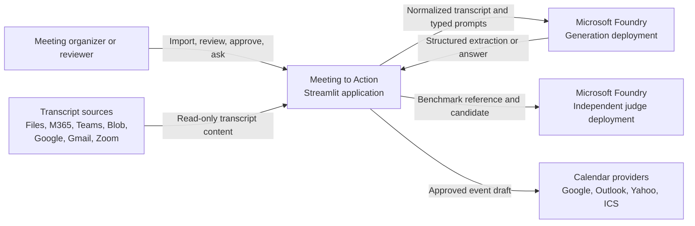
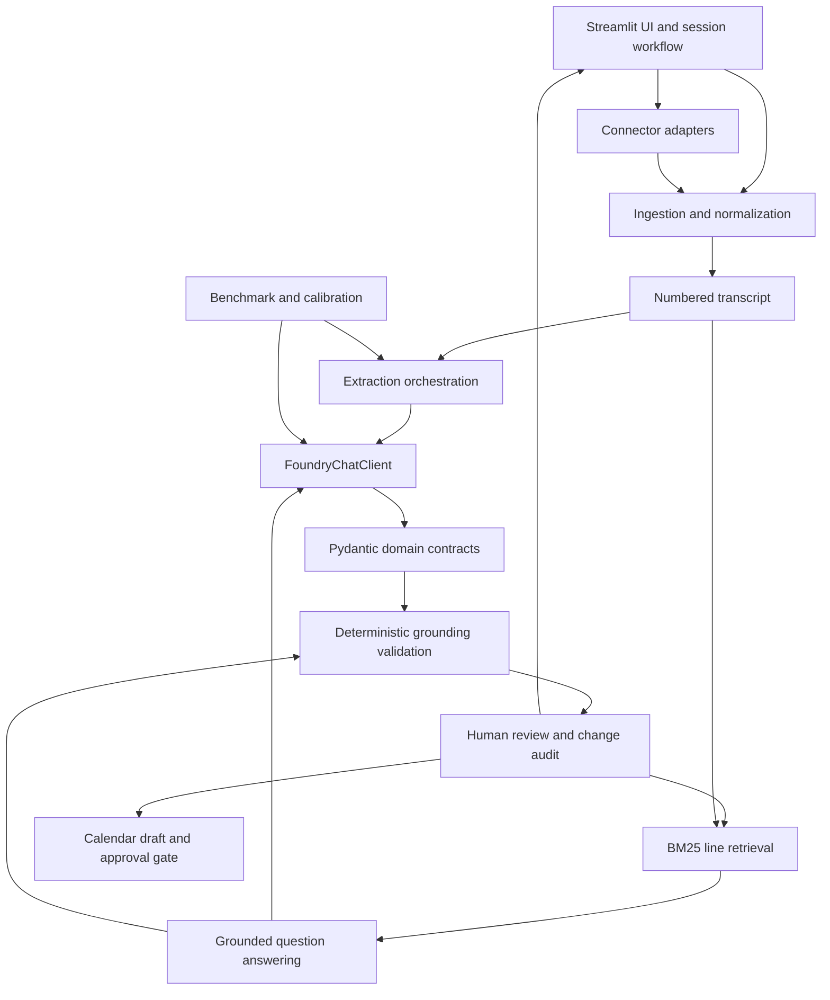
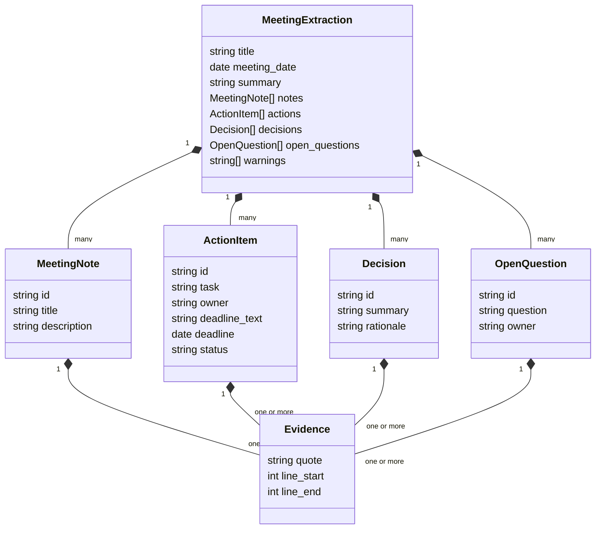
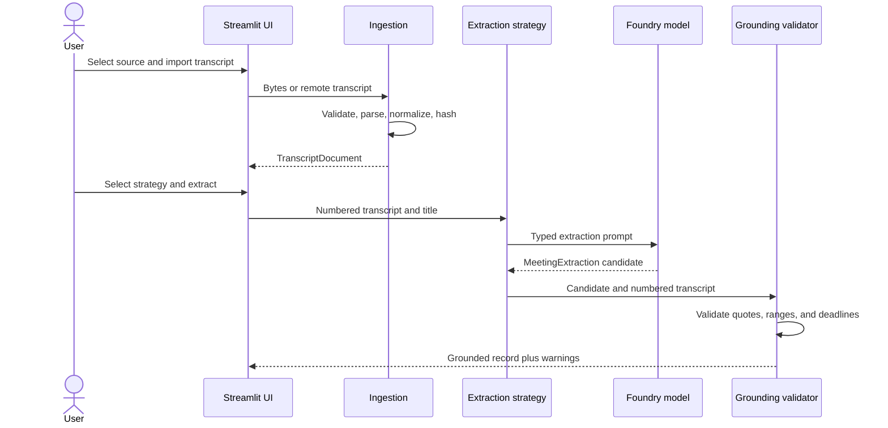
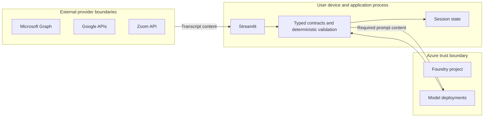
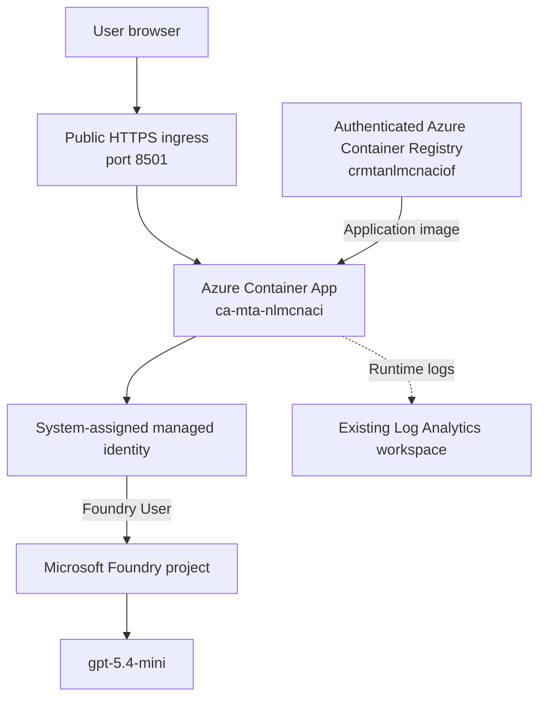

# Meeting to Action

## System Design Document

**Status:** Implemented capstone system
**Last updated:** September 27, 2026
**Primary runtime:** Python 3.12 and Streamlit
**AI platform:** Microsoft Foundry with Microsoft Agent Framework

---

## 1. Executive Summary

Meeting to Action converts one meeting transcript into a structured, evidence-grounded record of
notes, actions, decisions, and unresolved questions. A reviewer can correct and approve that
record, ask cited questions about the meeting, and prepare follow-up calendar events. The system
is intentionally scoped to one meeting at a time and does not autonomously execute business
actions.

The current implementation is a modular monolith: Streamlit owns the user interface and session
workflow, while focused Python modules own ingestion, extraction, retrieval, grounding,
human review, connector access, calendar preparation, and evaluation. Microsoft Foundry hosts the
generation and independent judge deployments. Pydantic contracts and deterministic evidence
checks form the boundary between probabilistic model output and trusted application state.

The central design principle is that fluent model output is not proof. Every accepted record must
carry an exact transcript quote and line range, survive deterministic validation, and pass human
review before it can support question answering or a downstream calendar action.

## 2. Problem Definition

### 2.1 Problem specificity

Meeting transcripts contain commitments and decisions that are difficult to retrieve and convert
into reliable follow-up records. General summarization is insufficient because it can omit
important outcomes, infer owners or dates, and lose traceability to the source.

The system solves a narrow problem:

> Given one meeting transcript, produce a typed, evidence-grounded meeting record that a person
> can review, approve, query, and use to prepare calendar follow-up.

### 2.2 In scope

- Import one transcript from a local file or configured remote source.
- Normalize the source into stable, numbered lines.
- Extract notes, actions, decisions, and open questions.
- Compare three model orchestration strategies.
- Validate evidence quotes, line ranges, and explicit deadline years.
- Let a human edit and approve the structured record.
- Record field-level changes made during review.
- Answer meeting questions from retrieved evidence and the approved record.
- Prepare calendar drafts only after explicit user confirmation.
- Evaluate quality, grounding, latency, and model-call cost.

### 2.3 Out of scope

- Autonomous task execution or automatic invitation delivery.
- Organization-wide knowledge search.
- Cross-meeting action tracking.
- Durable multi-user workflow and reviewer identity management.
- Automatic PII redaction from transcript content.
- Using the LLM judge as the sole quality or safety control.

## 3. Requirements

### 3.1 Functional requirements

| ID | Requirement |
| --- | --- |
| FR-1 | Accept pasted text and TXT, VTT, SRT, DOCX, or EML files up to 10 MB. |
| FR-2 | Read transcripts from configured Microsoft 365, Teams, Azure Blob, Google Drive, Gmail, and Zoom sources. |
| FR-3 | Normalize content into stable numbered lines while preserving speaker text. |
| FR-4 | Produce a schema-valid `MeetingExtraction`. |
| FR-5 | Attach at least one exact evidence citation to every extracted record. |
| FR-6 | Support single-model, extractor-verifier, and specialist-consolidator strategies. |
| FR-7 | Allow human editing while preserving source evidence and recording changed fields. |
| FR-8 | Answer supported questions with validated citations and reject unsupported topics. |
| FR-9 | Require explicit approval before creating or opening a calendar draft. |
| FR-10 | Evaluate all model strategies on a frozen benchmark with deterministic and judged metrics. |

### 3.2 Quality attributes

| Attribute | Design response |
| --- | --- |
| Grounding | Exact quote and line-range validation after every extraction and answer. |
| Safety | No inferred owners or years; no autonomous calendar action; human approval gate. |
| Explainability | Every record exposes source evidence; review changes are auditable. |
| Maintainability | Domain behavior is separated into small Python modules with typed contracts. |
| Testability | External/model boundaries are mockable; 40 automated tests cover core behavior. |
| Cost awareness | Architecture comparison records generation calls and latency per strategy. |
| Privacy | Credentials and connector metadata are excluded from prompts; transcript content is sent only to the configured Foundry model. |
| Availability | Current local runtime is single-instance and has no high-availability guarantee. |

## 4. System Context

### 4.1 Actors

- **Meeting organizer:** imports a transcript and selects an extraction strategy.
- **Reviewer:** verifies evidence, edits fields, approves the record, and authorizes calendar work.
- **Calibration reviewer:** independently scores blinded evaluation candidates.
- **Cloud administrator:** provisions Foundry resources, deployments, access roles, and monitoring.

### 4.2 External dependencies

- Microsoft Foundry project and model deployments.
- Azure CLI or managed identity credentials for Foundry and Azure Blob access.
- Microsoft Graph delegated authentication for Microsoft 365 and Teams.
- Google OAuth for Drive, Gmail, and Calendar.
- Zoom Server-to-Server OAuth for cloud transcripts.
- Browser or desktop calendar handlers for provider drafts and ICS files.

## 5. Logical Architecture

### 5.1 Component responsibilities

| Component | Responsibility |
| --- | --- |
| `app.py` | UI composition, session-state workflow, user events, review tabs, and action gating. |
| `meeting_to_action/connectors.py` | Read-only authentication and retrieval adapters for remote transcript sources. |
| `meeting_to_action/ingestion.py` | File validation, format parsing, metadata extraction, normalization, and content hashing. |
| `meeting_to_action/transcript.py` | Stable line numbering, quote lookup, grounding validation, and repair. |
| `meeting_to_action/models.py` | Shared typed contracts for evidence, notes, actions, decisions, questions, and complete records. |
| `meeting_to_action/extraction.py` | Foundry client construction and the three extraction orchestration strategies. |
| `meeting_to_action/retrieval.py` | BM25 ranking and neighboring-line context expansion. |
| `meeting_to_action/chat.py` | Grounded factual answers and labeled analytical synthesis. |
| `meeting_to_action/review.py` | Reconstruction of reviewed records while preserving evidence and producing field-level audits. |
| `meeting_to_action/calendar.py` | Calendar payload generation, provider dispatch, and approval enforcement. |
| `meeting_to_action/evaluation.py` | Frozen benchmark execution, deterministic metrics, semantic F1, and independent judge calls. |
| `meeting_to_action/calibration.py` | Blinded reviewer packets and judge-human agreement calculation. |

## 6. Data Design

### 6.1 Primary data objects

`TranscriptDocument` contains source type, external identifier, title, filename, normalized text,
SHA-256 content hash, import timestamp, MIME type, and source metadata.

`MeetingExtraction` is the aggregate root for generated and approved meeting records:

### 6.2 State and persistence

The current application stores imported content, generated records, approved records, chat
history, selected evidence, and change audit in Streamlit session state. Evaluation datasets and
results are local JSON or CSV files. OAuth token files are local and ignored by source control.

This design is suitable for a single-user capstone but is not a durable system of record. A
production design should persist approved records and immutable audits in an authenticated data
store, encrypt data at rest, associate changes with reviewer identity, and apply retention rules.

### 6.3 Data lifecycle

1. Import raw bytes or remote text.
2. Validate size and supported format.
3. Parse and normalize text.
4. Compute a content hash and clear stale derived state when the source changes.
5. Number transcript lines and submit only required content to Foundry.
6. Validate and repair model evidence.
7. Store generated and reviewed objects in the active session.
8. Export audits or calendar payloads only at user request.
9. Lose session data when the process or session ends unless the user exported it.

## 7. Core Processing Flows

### 7.1 Transcript ingestion and extraction

### 7.2 Human review and approval

The reviewer edits business fields but cannot silently replace model evidence through the editable
table. `apply_review_edits` reconstructs every record using the original evidence. Pydantic
revalidates the result. `build_change_audit` compares audited fields and emits before/after values.
Only the approved record is used by grounded Ask and calendar preparation.

### 7.3 Grounded question answering

1. BM25 ranks normalized transcript lines for the question.
2. The top eight lines are expanded by one line on either side.
3. Original line numbers are retained.
4. Retrieved evidence and the approved meeting record are sent to the answer agent.
5. A supported answer must contain at least one citation.
6. Every citation is validated against the complete transcript.
7. Invalid citations fail the request rather than reaching the UI as trusted output.

### 7.4 Calendar action

The calendar module receives only an approved action and user-entered scheduling details. The UI
shows the complete event payload and requires explicit confirmation. Google Calendar uses OAuth;
Outlook and Yahoo open user-reviewed drafts; other providers use an ICS download. The system does
not automatically send invitations.

## 8. Model Orchestration

### 8.1 Strategies

| Strategy | Calls | Design | Primary tradeoff |
| --- | ---: | --- | --- |
| Single model | 1 | One agent returns the complete record. | Lowest latency and cost; no semantic verification stage. |
| Extractor + verifier | 2 | A second agent audits and corrects the first result. | Better separation of generation and verification at moderate cost. |
| Specialists + consolidator | 4 | Three concurrent specialists feed one consolidator. | Highest decomposition and model cost; useful for dense meetings. |

All strategies share the same typed contracts and deterministic validation. The selected default is
extractor + verifier because it provides an explicit audit boundary, achieved the highest semantic
F1 in the frozen run, and uses half the generation calls of the specialist design. This is a
tradeoff decision, not a claim of dominance across every metric.

### 8.2 Context handling

- Extraction receives the complete numbered transcript for one meeting.
- Ask receives a BM25-selected evidence window plus the approved structured record.
- Prompts prohibit outside facts and inferred owners or deadlines.
- A normalized date is allowed only when the cited transcript explicitly states the year.
- Provider credentials, tokens, URLs, and connector metadata are not included in prompts.

### 8.3 Model deployments

- **Generation:** `gpt-5.4-mini` through `FOUNDRY_MODEL`.
- **Independent evaluation judge:** `gpt-4.1-judge` through `FOUNDRY_JUDGE_MODEL`.
- The evaluation code rejects a missing judge deployment or one with the same name as the
  generation deployment.

## 9. Retrieval Design

BM25 is used instead of a vector database because the active search corpus is one transcript,
questions frequently contain exact names or deadlines, and line-level auditability is mandatory.
Neighbor expansion preserves local conversational context without sending the full transcript for
every question.

Advantages:

- Deterministic and inspectable ranking.
- No embedding service or persistent index required at runtime.
- Original evidence line numbers remain stable.
- Low operational complexity for a single document.

Limitations:

- Lexical retrieval can miss paraphrases.
- It does not support organization-wide or cross-meeting retrieval.
- There is no reranker or learned relevance model.

A production cross-meeting design should add tenant-filtered hybrid retrieval, document-level
authorization filters, index deletion on retention events, and retrieval quality evaluation before
changing the current implementation.

## 10. Security, Privacy, and Guardrails

### 10.1 Trust boundaries

### 10.2 Identity and access

- Foundry uses `AzureCliCredential` locally and `ManagedIdentityCredential` in the deployed
    Container App.
- The Container App system identity has `Foundry User` at project scope and `AcrPull` at registry
    scope; neither assignment is subscription- or resource-group-scoped.
- Microsoft Graph uses delegated permissions so access follows the signed-in user.
- Azure Blob access requires the Storage Blob Data Reader role.
- Google and Zoom use provider-specific OAuth credentials and least-privilege read scopes.
- Infrastructure assigns Azure roles to an explicit user or application principal.

### 10.3 PII handling

Meeting transcripts may contain names, email addresses, customer details, or other personal data.
The current system does not automatically detect or redact PII. Transcript content is processed in
application memory and sent to the configured Foundry model for extraction or question answering.
Credentials, access tokens, source URLs, and connector metadata are excluded from model prompts.

Production requirements should include documented user consent, tenant-approved model data
handling, data classification, configurable redaction, regional processing requirements, retention
and deletion policies, encrypted durable storage, and access/audit controls.

### 10.4 Guardrails

- Pydantic rejects malformed or incomplete structured output.
- Evidence is mandatory for every extracted record.
- Exact quotes must occur within declared transcript ranges.
- Unsupported records are removed or surfaced through warnings.
- Owners and deadlines cannot be inferred when not explicit.
- Supported answers require validated citations.
- Unsupported questions receive an explicit not-covered response.
- Human approval gates all downstream calendar actions.
- Independent human calibration constrains interpretation of judge scores.

## 11. Deployment Architecture

### 11.1 Current environment

The application is deployed and publicly reachable at
https://ca-mta-nlmcnaci.greenground-3fac55c9.eastus2.azurecontainerapps.io/. The hosted runtime uses
Azure Container Apps in East US 2 and references the existing Microsoft Foundry account and project
without modifying them. The generation and independent judge deployments remain separate; only
`gpt-5.4-mini` is used by the interactive website.

| Deployment property | Live value |
| --- | --- |
| Region | East US 2 |
| Container App | `ca-mta-nlmcnaci` |
| Container Apps environment | `cae-mta-nlmcnaci` |
| Registry | `crmtanlmcnaciof`, Basic, admin user disabled |
| Runtime | Python 3.12 non-root image, single revision, 0-1 replicas |
| Ingress | Public HTTPS only, insecure transport disabled |
| Health | Root and `/_stcore/health` return HTTP 200 |
| Identity | System-assigned; project-scoped `Foundry User`, registry-scoped `AcrPull` |
| Live AI verification | Extractor + verifier returned grounded actions, decisions, notes, and questions |

Local development remains available at `localhost:8501` and uses `AzureCliCredential`. Hosted
Google, Zoom, and delegated Microsoft connector flows are not enabled until server-safe OAuth
callbacks and durable token storage are designed.

### 11.2 Production hardening roadmap

- Add Microsoft Entra authentication and per-user authorization; the current endpoint is
    intentionally public.
- Store secrets in Key Vault and never in application files.
- Persist approved records and immutable audits in a tenant-partitioned database.
- Enable Application Insights with privacy-reviewed telemetry.
- Add health probes, deployment slots or revisions, backups, and recovery objectives.
- Keep generation and judge deployments logically separate.
- Apply network controls and private endpoints where organizational policy requires them.

## 12. Reliability and Failure Handling

| Failure | Current response |
| --- | --- |
| Unsupported file or file over 10 MB | Reject before parsing. |
| Empty or unreadable transcript | Reject with a validation error. |
| Connector authentication/API failure | Surface a connector-specific error without sending credentials to the model. |
| Malformed model response | Fail Pydantic validation. |
| Unsupported evidence quote | Remove or reject the affected record and emit a warning. |
| Incorrect line range with uniquely found quote | Repair the range deterministically. |
| Invalid answer citation | Fail the grounded answer. |
| Missing Foundry configuration | Allow deterministic demo mode; reject Foundry strategies. |
| Calendar not approved | Do not invoke the provider action. |
| Session/process loss | Current in-memory work is lost unless exported. |

The model calls currently have no application-level queue, retry budget, circuit breaker, or
durable checkpoint. Production hardening should add bounded retries for transient errors,
request-level timeouts, idempotency for external writes, structured telemetry, and clear recovery
messages.

## 13. Observability

The application exposes user-visible warnings, evidence validation failures, latency, and
model-call counts through its workflow and evaluation artifacts. Automated tests validate
deterministic behavior. The deployed Container Apps environment sends runtime logs to the existing
Log Analytics workspace; Application Insights remains attached to the Foundry project.

Production telemetry should include:

- Correlation ID, operation name, strategy, duration, and success status.
- Model deployment, token consumption, throttling, and retry counts.
- Connector type and failure class without transcript content or credentials.
- Validation removals and repairs as aggregate counters.
- Approval and calendar-action events with authorized reviewer identity.
- No raw transcript, prompt, model response, token, or PII in default logs.

## 14. Evaluation Design and Results

### 14.1 Training and public dataset disclosure

The system performs inference and evaluation only; it does not train or fine-tune a model.
`gpt-5.4-mini` and `gpt-4.1-judge` are pretrained Microsoft Foundry deployments whose
provider-managed pretraining corpora are outside this repository's data pipeline. User-provided
transcripts remain runtime inputs and are not accumulated into an application training dataset.

The **AMI Meeting Corpus** is the only external public dataset incorporated into the repository.
It is used only for evaluation. The benchmark is reproducibly derived from AMI manual annotations
version 1.6.2 under CC BY 4.0 from https://groups.inf.ed.ac.uk/ami/corpus/. Its 24 grounded excerpts
are split into 18 development cases and six frozen test cases. Every generated record retains the
source meeting ID, version, license, source URL, annotation method, and exact dialogue evidence.

The semantic F1 calculation uses pretrained `sentence-transformers/all-MiniLM-L6-v2` embeddings;
the project neither trains that model nor includes its training corpus. Synthetic test fixtures
and manually entered demonstration transcripts are not external public datasets.

### 14.2 Evaluation benchmark

The benchmark contains 24 annotation-linked AMI Meeting Corpus excerpts: 18 development cases and
six frozen test cases. Every test case is evaluated with all three strategies. Metrics include
exact entity F1, semantic entity F1, deterministic grounding rate, latency, generation calls, and
an independent structured judge score.

| Strategy | Exact F1 | Semantic F1 | Grounding | Judge average | Mean latency | Calls/case |
| --- | ---: | ---: | ---: | ---: | ---: | ---: |
| Single model | 0.000 | 0.057 | 1.000 | 4.000 | 11.588 s | 1 |
| Extractor + verifier | 0.000 | 0.077 | 1.000 | 4.168 | 20.932 s | 2 |
| Specialists + consolidator | 0.000 | 0.045 | 1.000 | 4.278 | 32.995 s | 4 |

Two blinded reviewers completed 36 ratings for the 18 candidates. Human calibration passed:

- Judge-human overall MAE: 0.630, below the 0.750 maximum.
- Scores within one point of the human mean: 92.6%, above the 80% minimum.
- Inter-reviewer MAE: 0.111.
- Four of 54 candidate-dimension comparisons differed by more than one point.

The metrics disagree in meaningful ways. Exact and semantic matching are low while deterministic
grounding and judge scores are high. The judge also overestimated completeness on three outlier
dimensions and produced one grounding false negative. Consequently, no single metric is treated
as conclusive, and the judge does not replace deterministic validation or human review.

## 15. Key Design Decisions

| Decision | Rationale | Tradeoff |
| --- | --- | --- |
| Modular monolith | Fast delivery and simple local debugging for one workflow. | No independent scaling or fault isolation between components. |
| Microsoft Agent Framework and Foundry | Typed agent responses and consistent orchestration across strategies. | Cloud dependency, model latency, quota, and cost. |
| Pydantic contracts | Machine-checkable boundaries shared by extraction, review, chat, and evaluation. | Schema evolution requires coordinated changes. |
| Exact evidence validation | Provides auditable support independent of model confidence. | Valid paraphrased evidence cannot replace an exact quote. |
| BM25 retrieval | Transparent and inexpensive for one transcript. | Lower paraphrase recall than hybrid semantic retrieval. |
| Extractor + verifier default | Explicit audit stage and best frozen semantic F1 at moderate call cost. | Slower and more expensive than the single model. |
| Session-state storage | Minimal infrastructure for a capstone workflow. | No durable history, concurrency control, or multi-user audit. |
| Human calendar gate | Prevents unintended external actions. | Requires manual completion of each action. |

## 16. Scalability and Evolution

The current bottleneck is model inference rather than local parsing. Specialist extraction already
runs three independent calls concurrently, but a single Streamlit process still owns workflow
state. For higher volume:

1. Separate the UI from an authenticated API.
2. Move extraction and evaluation to asynchronous workers with durable job state.
3. Store transcripts, approved records, and audits in tenant-partitioned persistence.
4. Add per-tenant quotas, backpressure, cancellation, and idempotency keys.
5. Introduce hybrid search only for a measured cross-meeting retrieval requirement.
6. Keep deterministic validation synchronous at the trust boundary before persistence.

## 17. Testing Strategy

The 44-test suite covers contracts, transcript normalization, ingestion formats, evidence
validation and repair, extraction strategies, BM25 retrieval, grounded answers, review
reconstruction, change auditing, calendar approval, connectors, independent-judge safeguards,
semantic metrics, and human calibration reporting.

Additional production tests should cover load and soak behavior, identity and tenant isolation,
provider sandbox integration, accessibility, disaster recovery, prompt-injection resilience,
PII redaction, and end-to-end deployment verification.

## 18. Known Risks and Mitigations

| Risk | Impact | Current mitigation | Required production follow-up |
| --- | --- | --- | --- |
| Transcript contains sensitive data | Privacy or compliance exposure | Credentials excluded from prompts; in-memory session state | Classification, consent, redaction, retention, encryption, and DLP controls |
| Public unauthenticated endpoint | Unauthorized transcript submission and model-quota use | Public-access risk explicitly accepted for the capstone | Entra authentication, authorization, rate limits, and abuse monitoring |
| Hallucinated meeting record | Incorrect follow-up | Typed output, exact evidence validation, warnings, human approval | Ongoing benchmark monitoring and escalation policy |
| Judge bias or inconsistency | Misleading architecture choice | Separate deployment and human calibration | Track outliers and periodically recalibrate |
| Session-state loss | Lost work and audit | User exports | Durable authenticated persistence and backup |
| Provider outage or throttling | Failed imports or model calls | Errors surfaced to user | Timeouts, retries, circuit breaking, and asynchronous jobs |
| Weak lexical retrieval | Missed relevant evidence | Approved record plus neighboring BM25 context | Retrieval evaluation and tenant-filtered hybrid search if justified |
| Over-privileged connector application | Excess data exposure | Read-only and delegated scopes where possible | Formal least-privilege review and conditional access |

## 19. Open Decisions

- Decide when to replace approved public capstone access with Microsoft Entra authentication.
- Select durable stores for transcripts, approved records, and immutable audit events.
- Define transcript retention, deletion, and legal-hold requirements.
- Decide whether PII must be redacted before model processing.
- Establish service-level objectives and recovery objectives.
- Define model cost budgets and per-tenant rate limits.
- Determine when cross-meeting hybrid retrieval is justified by measured user needs.

## 20. Acceptance Summary

The implemented system satisfies the capstone focus areas:

- **Problem specificity:** one transcript to an approved, grounded follow-up record.
- **Data processing:** multi-format and remote-source ingestion with normalization and provenance.
- **Retrieval:** transparent BM25 selection with full-transcript citation validation.
- **Orchestration:** three measured single- and multi-agent designs with typed outputs.
- **Evaluation:** deterministic metrics, an independent LLM judge, and passed human calibration.
- **Decision reasoning:** architecture choices are tied to reliability, explainability, cost, and
  measured tradeoffs.

The design is complete for a capstone and is deployed as a public Azure demonstration. Durable
persistence, authenticated multi-user access, formal PII controls, stronger production
observability, and resilience remain explicit requirements before enterprise use.